## ComputerGraphics Filters

Лабораторная работа по курсу компьютерной графики.

Работу выполнили: [Damlrca](https://github.com/Damlrca), [Mortus19](https://github.com/Mortus19), [aartyomm](https://github.com/aartyomm)

### Примеры фильтров

***Инверсия***

|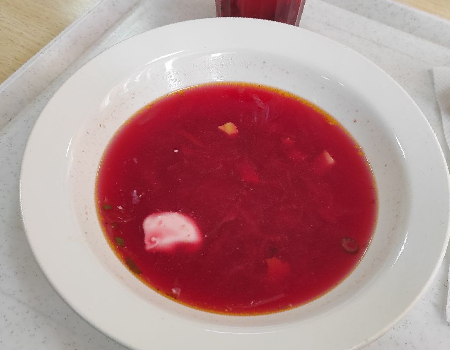|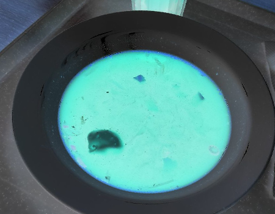|
|-|-|

***Размытие по Гауссу***

|||
|-|-|

***Выделение границ (Оператор Собеля)***

|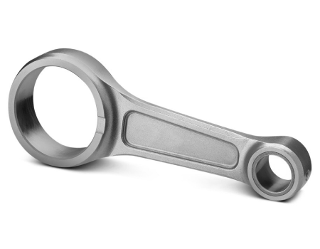|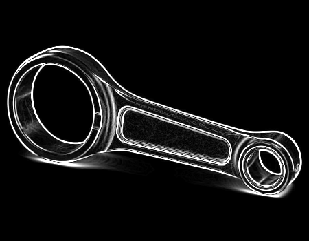|
|-|-|

***Тиснение***

|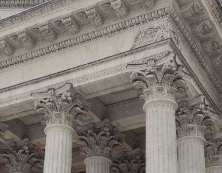|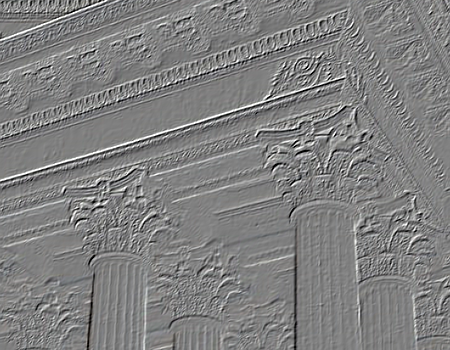|
|-|-|

***Медианный фильтр (подавление шума "соль и перец")***

|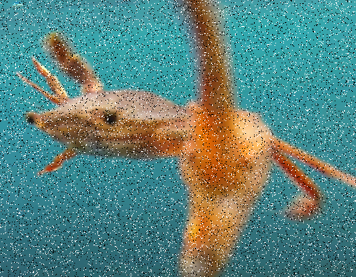|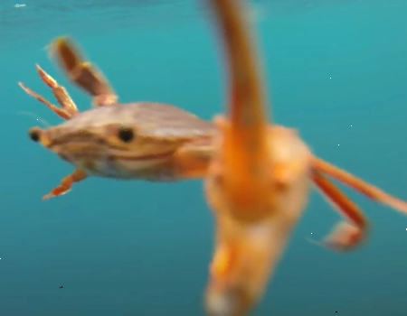|
|-|-|

***Линейное растяжение гистограммы***

|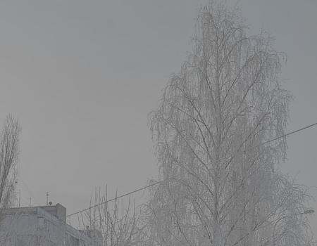|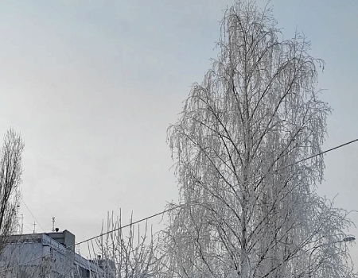|
|-|-|

***Оттенки серого + Дизеринг***

|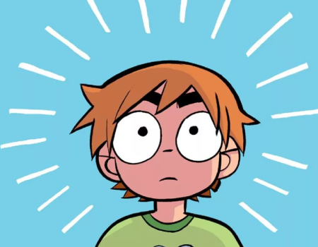|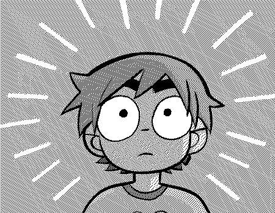|
|-|-|

***Статистическая цветокоррекция***

|Исходное|Целевое|Результат|
|:-|:-|:-|
|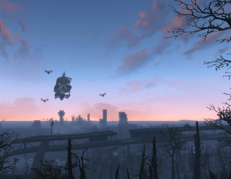|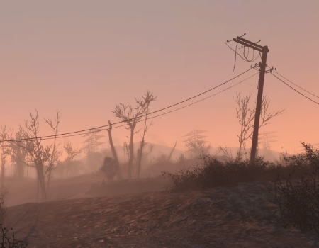|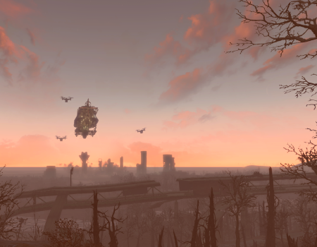|

***Компенсация разности освещения***

|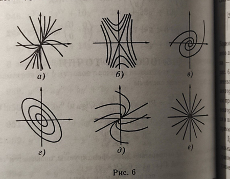|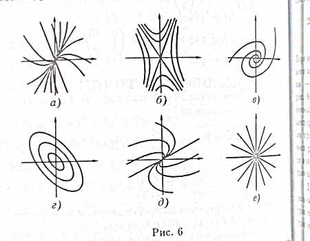|
|-|-|

### Список реализованных фильтров

- Точечные фильтры
	- Инверсия
	- Оттенки серого
	- Сепия
	- Увеличение яркости
- Матричные фильтры
	- Размытие
		- Прямоугольное размытие
		- Размытие в движении
		- Размытие по Гауссу
	- Выделение границ
		- Оператор Прюитт
		- Оператор Собеля
		- Оператор Щарра
	- Повышение резкости
	- Тиснение
	- Компенсация разности освещения
- Геометрические фильтры
	- Поворот
	- Перенос
	- "Волны"
	- "Стекло"
- Нелинейные фильтры
	- Медианный
	- Максимальный
	- Минимальный
- Глобальные фильтры
	- Повышение контрастности
	- Линейное растяжение гистограммы
	- "Серый мир"
	- "Идеальный отражатель"
	- Коррекция с опорным цветом
	- Статистическая цветокоррекция
- Добавление шумов
	- "Соль и перец"
- Квантование и дизеринг
- Морфологические фильтры
	- Расширение
	- Сужение
	- Открытие
	- Закрытие
	- Top Hat
	- Black Hat
	- Grad

А также разбиение на каналы RGB, YIQ, CMY, CMYK.

### Другие особенности работы

- Возможность сохранить обработанное изображение
- Возможность отменить последний примененный фильтр
- Возможность повторить последний примененный фильтр
- Пропорциональное изменение размеров элементов при изменении размера окна
